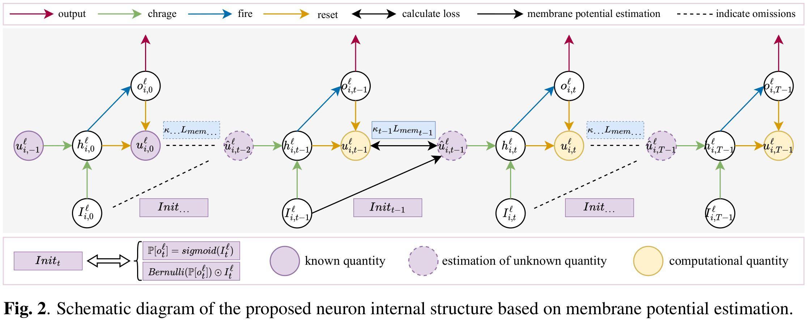
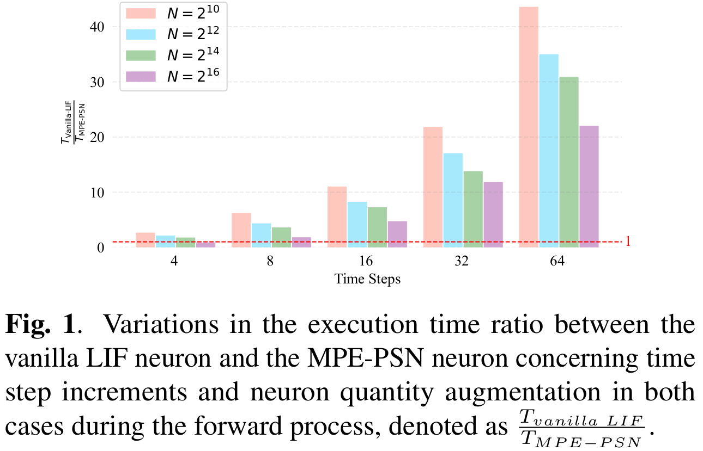
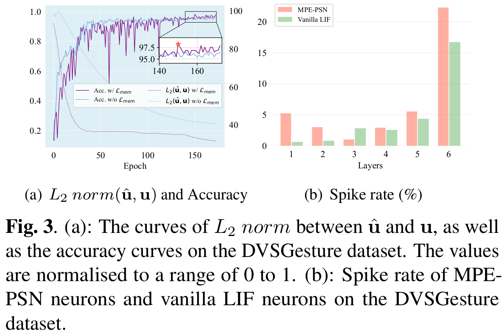
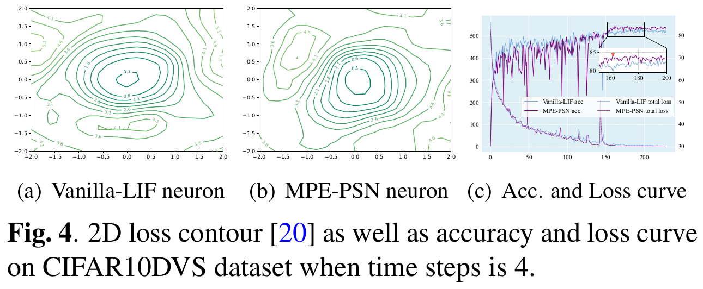

# MPE-PSN spiking neuron


This is the official Pytorch implementation of the paper [Time-independent Spiking Neuron via Membrane Potential Estimation for Efficient Spiking Neural Networks](https://arxiv.org/abs/2409.04978)

## Quickly begin
step1: clone the repo

```bash
git clone https://github.com/Chrazqee/MPE-PSN.git
```

step2: run the `*.sh` scripts we support (You may need to install certain packages on your own.)
```bash
chmod +x train.sh
./train.sh
```

and then, you will get the results that we support in related dirs.

## Some figures in the paper




## Citation
if you find our project useful, please cite:
```text
@misc{chen2024timeindependentspikingneuronmembrane,
      title={Time-independent Spiking Neuron via Membrane Potential Estimation for Efficient Spiking Neural Networks}, 
      author={Hanqi Chen and Lixing Yu and Shaojie Zhan and Penghui Yao and Jiankun Shao},
      year={2024},
      eprint={2409.04978},
      archivePrefix={arXiv},
      primaryClass={cs.CV},
      url={https://arxiv.org/abs/2409.04978}, 
}
```
## Acknowledgement
[PSN](https://github.com/fangwei123456/Parallel-Spiking-Neuron), [Spikingjelly](https://github.com/fangwei123456/spikingjelly) and, [NSNN](https://github.com/genema/Noisy-Spiking-Neuron-Nets)

For their implementations of code!!!
